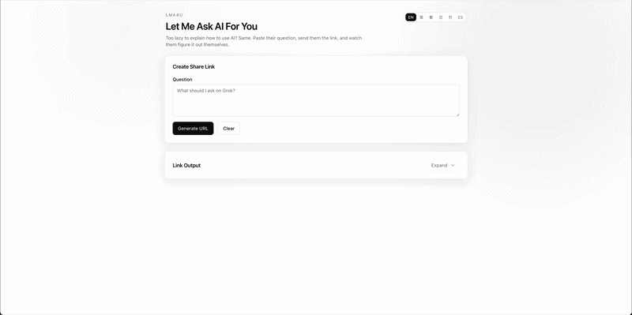

# lma4u — Let Me Ask AI For You

> *Because some people will ask YOU before they ask Google, Grok, or literally anything else.*

**[Try it live → lma4u.com](https://lma4u.com)**



---

## What is this?

You know that friend who sends you a wall of text asking how to do something they could've just asked Grok? Yeah. This is for them.

**lma4u** lets you paste their question, generate a magic link, and send it back. When they open it, they get a slick animated demo that shows them *exactly* how to ask Grok AI — complete with a typewriter effect, fake thinking animation, and a countdown that opens the real query automatically.

No more explaining. No more screenshots. Just a link.

---

## How it works

1. **Paste** their question into the box
2. **Generate** a tokenized share link
3. **Send** it — they click, watch the demo, get redirected to Grok with the query pre-filled
4. **Profit** — they learn to fish (maybe)

---

## Features

- Animated Grok-style demo with mouse cursor walkthrough
- Auto-redirect countdown to the real Grok query
- Link shortening via TinyURL
- 6 languages: English, 简体中文, 繁體中文, 日本語, 한국어, Español
- SEO optimised with sitemap, OG tags, hreflang
- Google Analytics ready (`NEXT_PUBLIC_GA_ID`)
- PWA manifest + favicon

---

## Stack

- Next.js 14 App Router
- next-intl (i18n)
- Tailwind CSS
- shadcn-style UI

---

## Local dev

```bash
npm install
npm run dev
# → http://localhost:3000
```

---

## Environment variables

```env
# Google Analytics (optional)
NEXT_PUBLIC_GA_ID=G-XXXXXXXXXX

# Canonical base URL for SEO/sitemap
NEXT_PUBLIC_SITE_URL=https://lma4u.com
```

---

## Deploy

[](https://vercel.com/new/clone?repository-url=https://github.com/somethingwentwell/lma4u)

---

## URL format

```
/[locale]/ask?k=BASE64URL_TOKEN&autoplay=1
```

- `k` — base64url encoded question
- `autoplay` — `1` auto-redirects after 5s, `0` disables it

> Base64 is obfuscation, not encryption. Don't put secrets in here.
